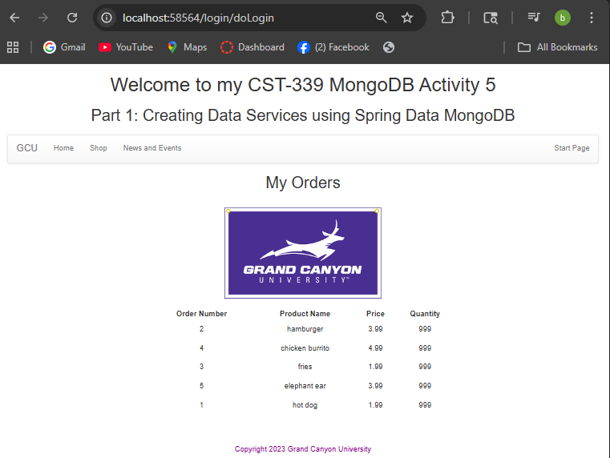
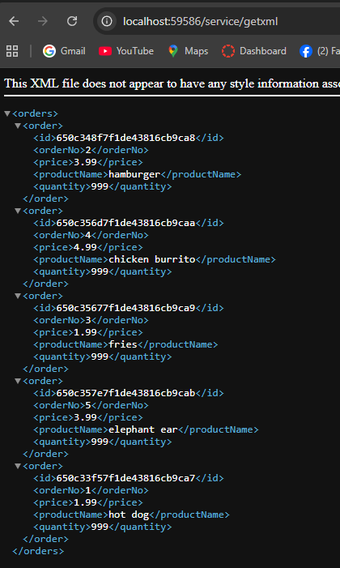
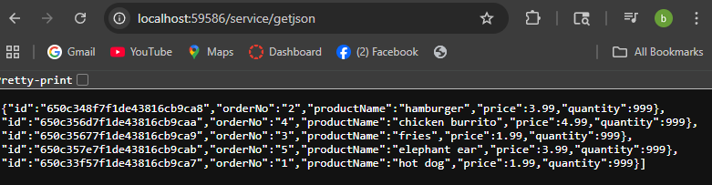
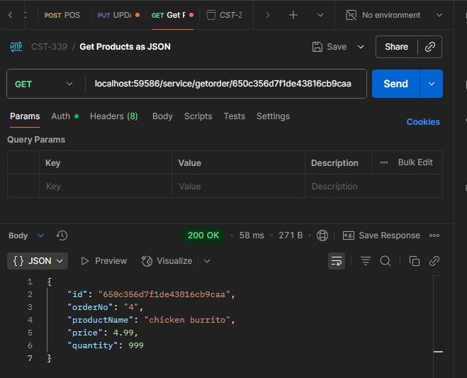
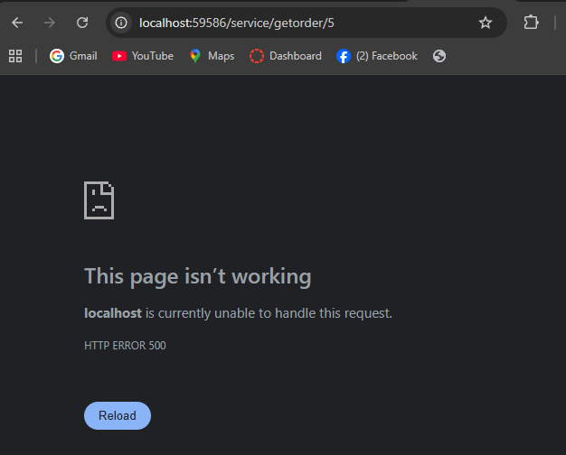
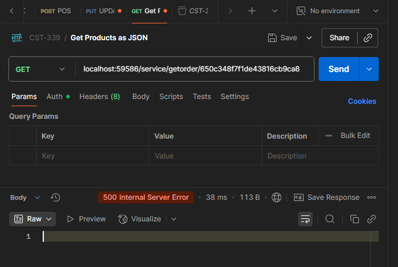

# Activity 5 - MongoDB
### Bruce Brown
### Grand Canyon University CST-339
### Professor Bobby Estey
### 10/05/2025

---

## Part 1: Creating Data Services Using Spring Data MongoDB

#### 1. Orders Page displayed in browser using Spring Data MongoDB Repository

 
This SS shows the Orders page successfully loading data from the MongoDB Atlas database instead of MySQL. The Orders are being retrieved using the MongoRepository interface, which handles all CRUD operations through Spring Data MongoDB. The application connects to a cloud hosted MongoDB Atlas cluster using the connection URL configured in the application.properties.

#### 2. XML response from MongoDB Repository using /service/getxml Endpoint

 
This screenshot displays the XML response generated by the /service/getxml endpoint. The same orders data from the MongoDB Atlas and is automatically converted to XML using Spring Boot's message converters, allowing the application to support multiple outpout formats.
 

#### 3. JSON response from MongoDB Repository using /service/getjson Endpoint

<b>This screenshot displays the JSON and the data is served directly from the MongoDB Atlas database as well using the MongoRepository service layer. Each object in the JSON array represents an order with its fields (id, orderNo, etc..) This demonstrates that the application can expose the same data in multiple formats without modifying the service layer.</b>

---

## Part 2: Rest API Queries by Order ID

#### 1. JSON response with a Valid ID

<b>This screenshot shows the JSON response using POSTMAN from the /service/getorder/{specificId} endpoint using a valid order ID from the MongoDB Atlas database. The applicaiton retrieves a single order using the Spring Data MongoRepository service layer.</b>

#### 2. JSON response with Invalid ID

<b>This screenshot shows the JSON response when querying /service/getorder/{specificId} with an invalid or non existent order ID. Since the ID does not exist in the MongoDB database and the endpoint does not currently handle missing orders gracefully, the application returns a 500 Internal Server Error. This demonstrates that the service correctly attempts to retrieve data, but additional error handling could be added to return a more user friendly response such as a 404 Not Found or empty result.</b>

#### 3. Invalid ID in PostMan SS

