<<<<<<< HEAD
# cst339
cst339
=======

# Activity 6 - Securing a Web Application and REST API's
### Bruce Brown
### Grand Canyon University CST-339
### Professor Bobby Estey
### 10/12/2025

---

## Part 1: Securing a Web Application Using an In-Memory Datastore

#### 1. Orders/Display page afer signing in using test/test as username & password

 
This screenshot demonstrates the secured Orders page successfully displayed after authenticating with the in-memory user credentials test/test. The application integrates Spring Security using a custom SecurityConfig class to manage authentication, authorization, and route protection. Upon successful login, users are redirected to the /orders endpoint, where the OrdersBusinessService retrieves data from the MongoDB Atlas database through the Spring Data MongoRepository interface. This confirms that user authentication and secure data access are functioning as intended within the application.

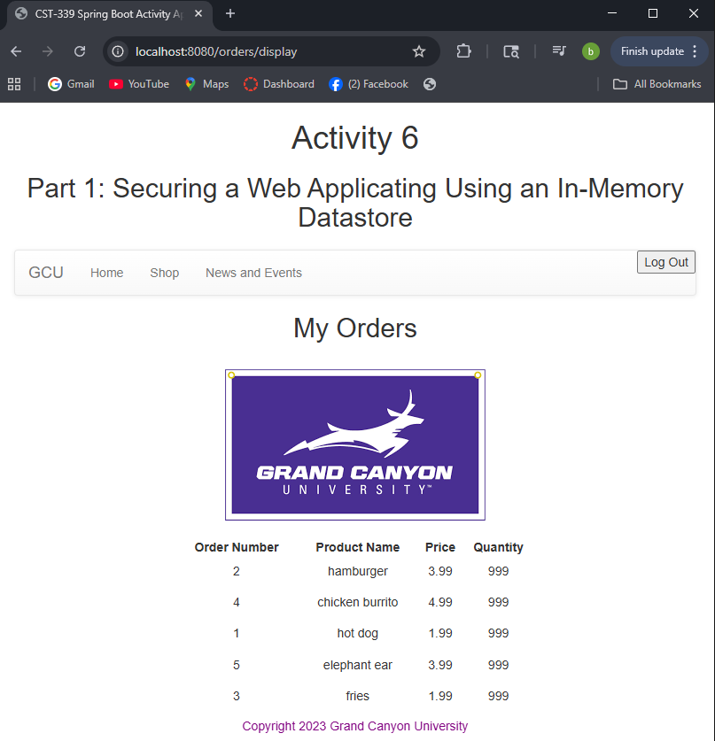

#### 2. JSON response from MongoDB Repository using /service/getjson Endpoint

 
The data is retrieved directly from the MongoDB Atlas database through the MongoRepository service layer. Each JSON object represents an order with fields such as id, orderNo, and total. This demonstrates that the application can expose data in multiple formats without modifying the service layer.
 

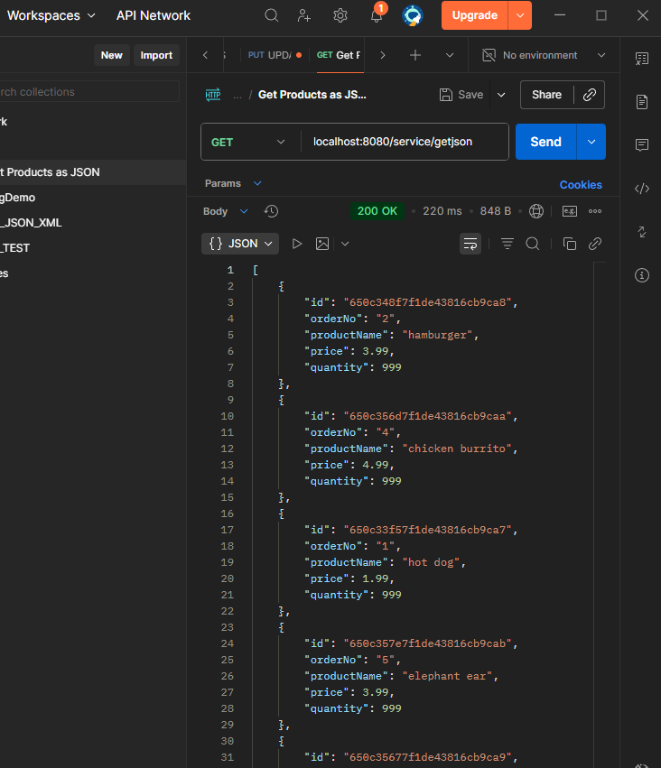

#### 3. XML response from MongoDB Repository using /service/getxml Endpoint.

The same orders data from MongoDB Atlas is automatically converted to XML using Spring Boot's message converters. This allows the application to support multiple output formats and demonstrates versatility in exposing data through REST APIs.

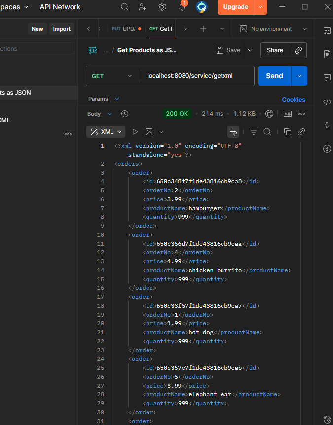

---

## Part 2: Securing a Web Application Using a Database

#### 1. New login page

<b>New logins layout page</b>

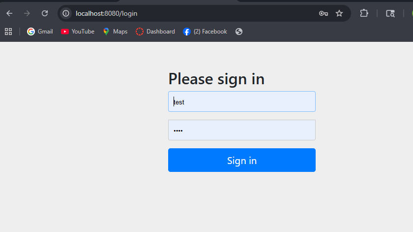

#### 2. Orders Page after Database Login

This screenshot shows the Orders page displayed after logging in using database-backed credentials stored in MongoDB. Users are authenticated against the MongoDB Atlas database, and the application retrieves order data via the `MongoRepository` service layer. This confirms that database-backed authentication and route protection are working correctly.

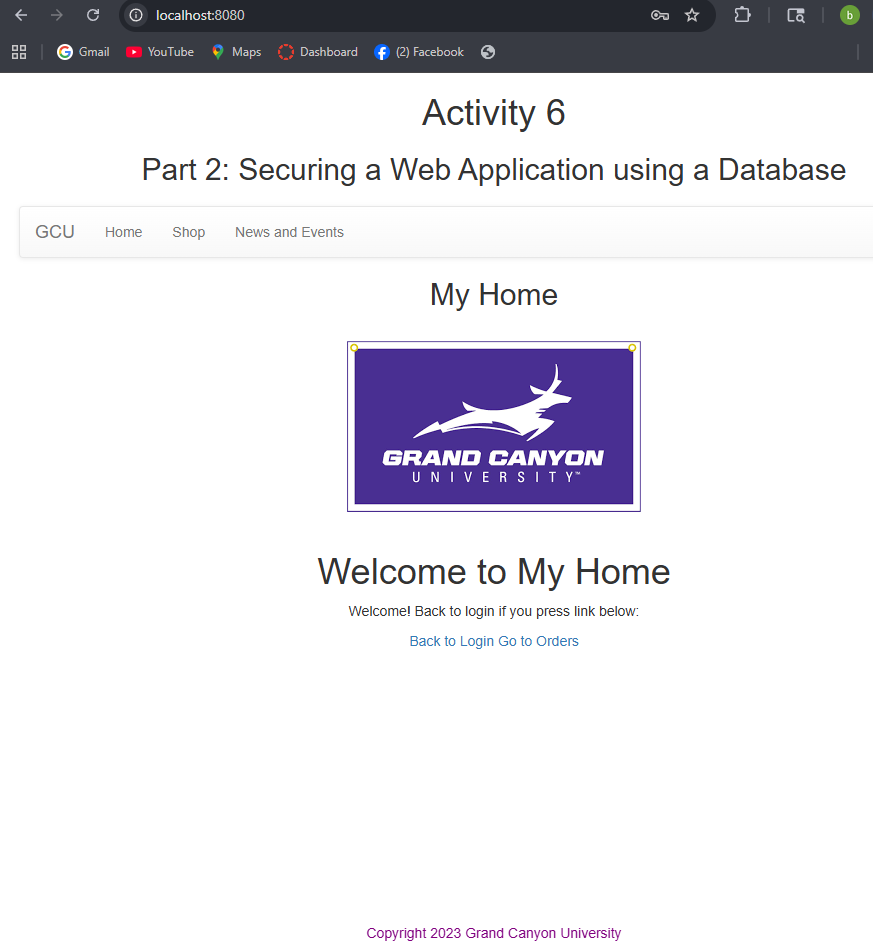

#### 3. XML Response from MongoDB Repository Using /service/getxml Endpoint
Spring Boot's message converters automatically handle the conversion, demonstrating multi-format support.
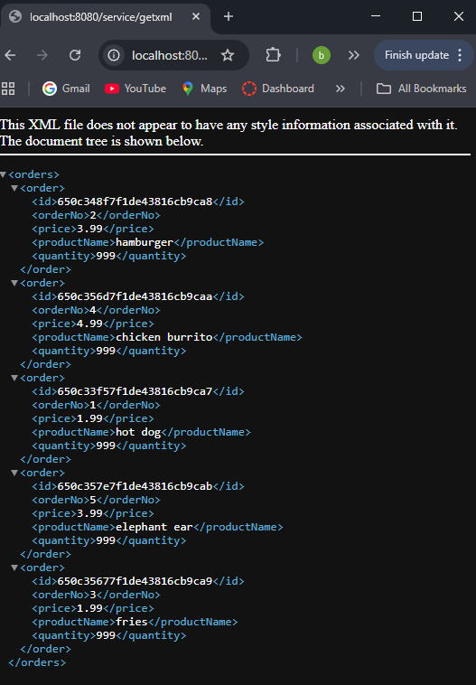

#### 4. JSON Response from MongoDB Repositry using /service/getjson Endpoint
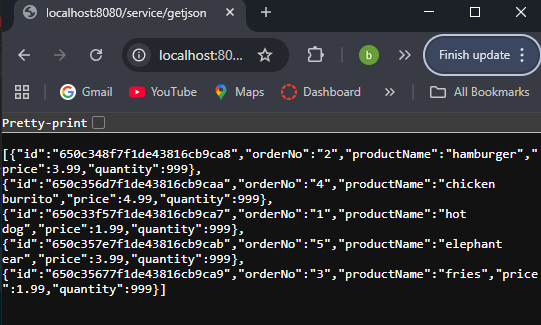

## Part 3: Securing REST APIs Using Basic HTTP Authentication

#### 1. /getjson API Response with Valid Credentials
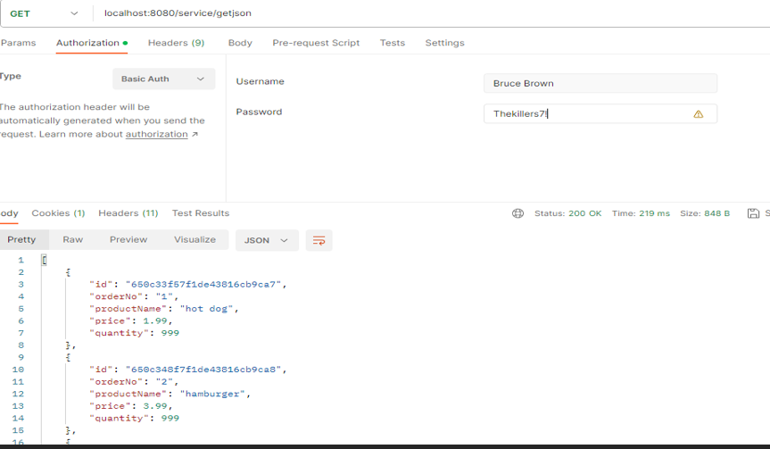

#### 2. getjson API Response with Invalid Credentials
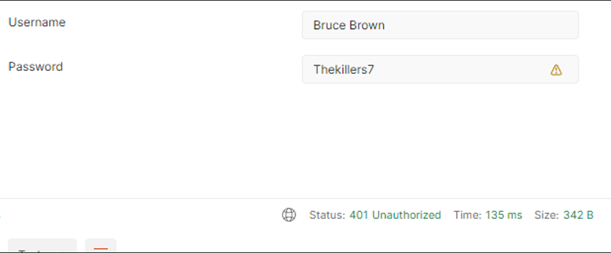

#### 3. /getxml API Response with Valid Credentials
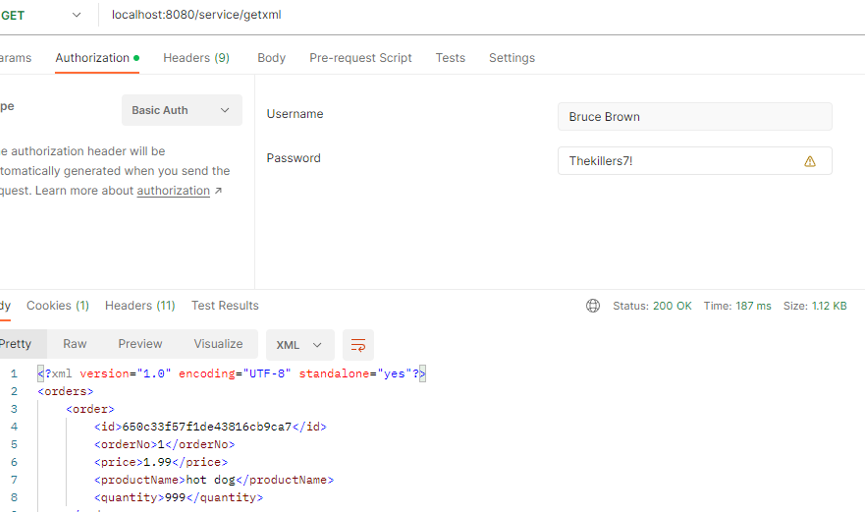

#### 4. /getxml API Response with Invalid Credentials
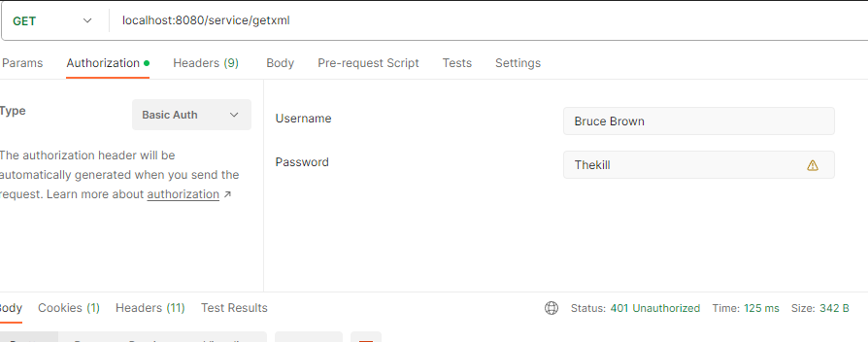

## Part 4: Securing REST APIs Using OAuth2 Authentication

#### 1. GitHub Login Screen

GitHub OAuth2 login page when accessing the /service/test API. Users are prompted to log in using their GitHub credentials for authentication.

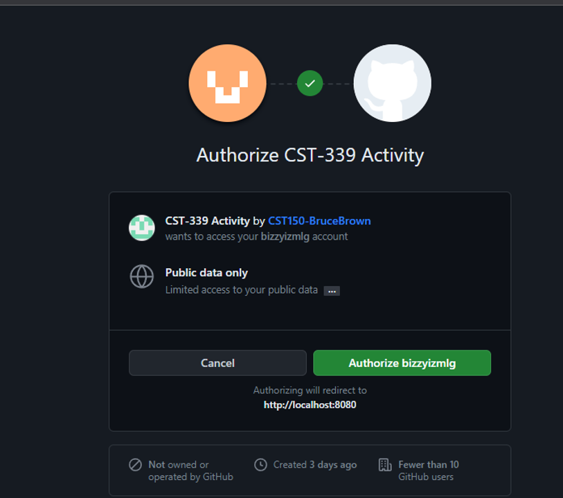

#### 2. Login Page after Authorization

service/test page with text

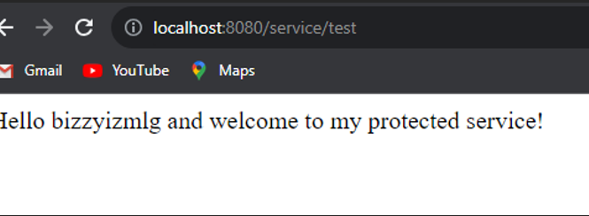

#### 3. API Respons in Console

PI response after authenticating via GitHub OAuth2. The REST API displays a "hello" message along with the authenticated user's GitHub username, confirming successful OAuth2 authentication.

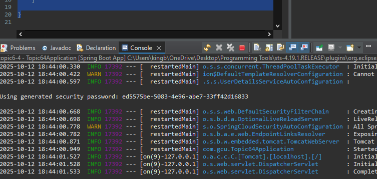

## Research Notes

### Forms-Based Authentication
Forms-based authentication is a method where a user logs in through a web form by providing a username and password. The credentials are submitted to a server, where they are verified. This method is widely used because it is secure, reliable, and relatively simple to implement (GeeksForGeeks, 2023). Using frameworks like Spring Security ensures sensitive data is protected, privacy is maintained, and fraud prevention is enforced. Without such security, users’ trust in web applications would be significantly compromised.

**Reference:**  
GeeksForGeeks. (2023). Authentication in Spring Security. https://www.geeksforgeeks.org/authentication-in-spring-security/

### Basic HTTP Authentication
Basic HTTP authentication is a method where the username and password are sent from the client to the server as a Base64-encoded string. While Base64 is not encryption, this scheme allows the server to verify credentials before granting access. It is often used to secure REST API endpoints, ensuring that only clients with valid credentials can access protected resources. However, it is recommended to use it over HTTPS to prevent credentials from being intercepted in transit (Microsoft, 2023).

**Reference:**  
Microsoft. (2023). Understanding HTTP Authentication. Microsoft Docs. https://learn.microsoft.com/en-us/dotnet/framework/wcf/feature-details/understanding-http-authentication
>>>>>>> 22db70e (Initial commit - CST 339 Activity 6)
