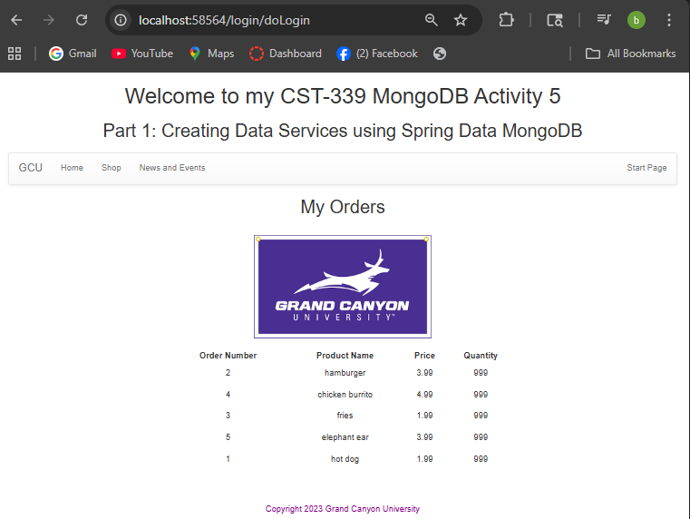
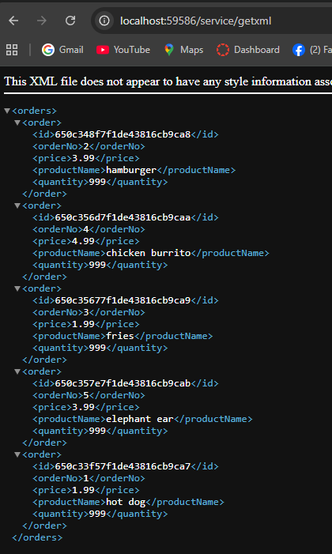
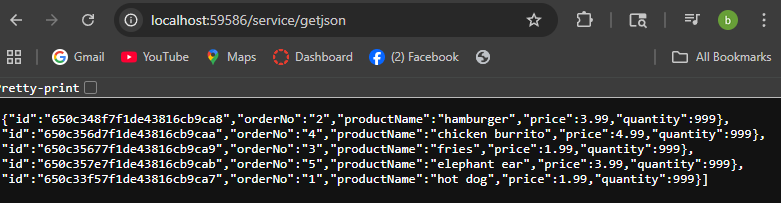
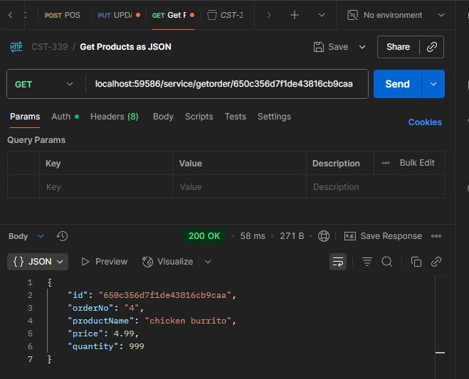
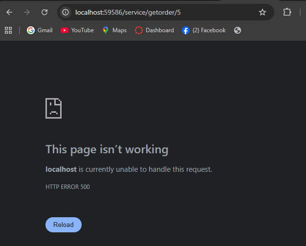
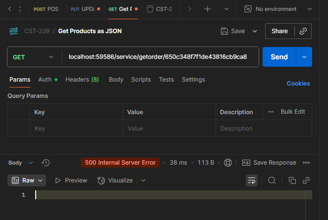

# Activity 5 - MongoDB
### Bruce Brown
### Grand Canyon University CST-339
### Professor Bobby Estey
### 10/05/2025

---

## Part 1: Creating Data Services Using Spring Data MongoDB

#### 1. Orders Page displayed in browser using Spring Data MongoDB Repository

 
This SS shows the Orders page successfully loading data from the MongoDB Atlas database instead of MySQL. The Orders are being retrieved using the MongoRepository interface, which handles all CRUD operations through Spring Data MongoDB. The application connects to a cloud hosted MongoDB Atlas cluster using the connection URL configured in the application.properties.

#### 2. XML response from MongoDB Repository using /service/getxml Endpoint

 
This screenshot displays the XML response generated by the /service/getxml endpoint. The same orders data from the MongoDB Atlas and is automatically converted to XML using Spring Boot's message converters, allowing the application to support multiple outpout formats.
 

#### 3. JSON response from MongoDB Repository using /service/getjson Endpoint

<b>This screenshot displays the JSON and the data is served directly from the MongoDB Atlas database as well using the MongoRepository service layer. Each object in the JSON array represents an order with its fields (id, orderNo, etc..) This demonstrates that the application can expose the same data in multiple formats without modifying the service layer.</b>

---

## Part 2: Rest API Queries by Order ID

#### 1. JSON response with a Valid ID

<b>This screenshot shows the JSON response using POSTMAN from the /service/getorder/{specificId} endpoint using a valid order ID from the MongoDB Atlas database. The applicaiton retrieves a single order using the Spring Data MongoRepository service layer.</b>

#### 2. JSON response with Invalid ID

<b>This screenshot shows the JSON response when querying /service/getorder/{specificId} with an invalid or non existent order ID. Since the ID does not exist in the MongoDB database and the endpoint does not currently handle missing orders gracefully, the application returns a 500 Internal Server Error. This demonstrates that the service correctly attempts to retrieve data, but additional error handling could be added to return a more user friendly response such as a 404 Not Found or empty result.</b>

#### 3. Invalid ID in PostMan SS

#### 4. Research Questions and Conclusion

<b>1. </b>Compare and contrast the design of schema in a relational database and a non-relational database. How do they differ and what impacts does migrating from a relational database to a non-relational database have on your application design?

In non-relational databases (NoSQL), a schema structured can be structured in a few various ways such as column style, graphs, document, and/or as a key-value store (GeeksForGeeks, 2024). As for relational databases (RDBMS), the schemas structures are predefined in order to decide how it will move forward with the data (GeeksForGeeks, 2024). The schema will lay out the blueprint on how it will organize the data. The language in SQL databases is extremely powerful. It is said to be one of the most versatile, most used worldwide, and safest choices when it comes to working with complex queries. That said, some structures SQL offers include documents, graphs, columns, and key-value pairs.  
If a programmer wants to migrate from a NoSQL database to a SQL database or vice versa, there will be many impacts to consider. To start, the code in the program will have to be changed to intertwine or any connections that will be needed. Not to mention the data itself will be changed to work with the new schema. Lastly, it can potentially take up a ton of time which could be a waste of resources and/or money for the company. Unless a migration of the two databases is needed to be merged, such as for scalability considerations, and the program needs to be expanded, perhaps this would be a cause to consider (GeeksForGeeks, 2023). 

 Reference: 
GeeksForGeeks. (2024). Difference between SQL and NoSQL. https://www.geeksforgeeks.org/difference-between-sql-and-nosql/  

<b>2.</b> Compare and contrast the features of a relational database and a nonrelational database. Provide three advantages and rationale for why you would select a relational database. Provide three advantages and rationale for why you would select a nonrelational database.

Relational and nonrelational databases take fundamentally different approaches to storing and retrieving data. Relational databases use fixed, tabular schemas with rows, columns, and foreign keys, strong ACID transactions, and SQL for powerful joins and analytics; they offer proven reliability, mature tooling, and precise consistency—qualities you rely on when correctness matters, like in banking or inventory systems. Nonrelational databases, by contrast, favor flexible or schema-less models (documents, key-value, wide-column, graph) that adapt quickly to changing data, scale horizontally across many servers, and deliver high throughput for large, distributed applications; they trade some transactional strictness for performance and agility and often shine when the data is heterogeneous or access patterns are simple and predictable. Choose relational when you need guaranteed consistency, rich querying, and robust administrative support; choose nonrelational when you need rapid schema evolution, massive scale, or a data model tailored to a specific domain. In short, one promises steady, dependable order like a well-run ledger, while the other offers restless, scalable freedom to grow and change with your application.

