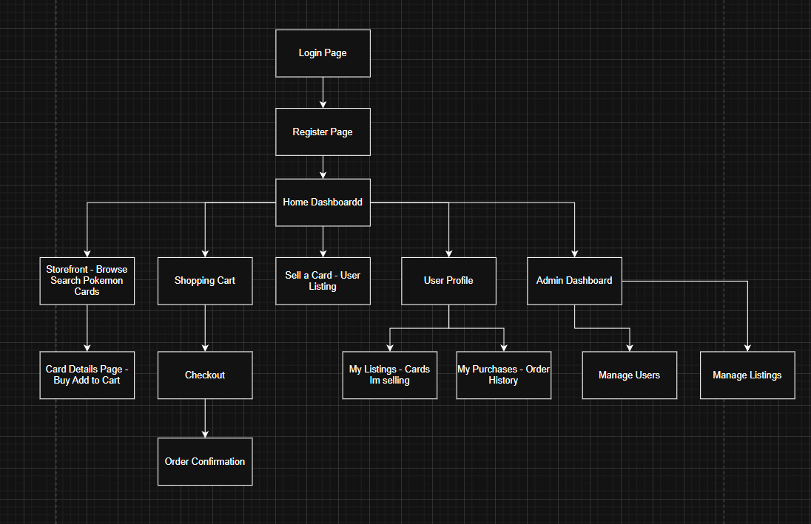

# CST-339 Project Design Report – Milestone 1

## Topic / Date / Revision
| Project Design | 9/8/2025 |
|-------|------|
| 1 – Project Proposal and Initial Design | 9/7/2025 | 1.0 |

## Team
- Individual Project – Bruce Brown

---

## Weekly Status Summary
| User Story | Team Member | Hours Worked | Hours Remaining | Git URL | 
|------------|------------|--------------|----------------|---------|
| Milestone 1: Project Proposal & Initial Design | Bruce Brown | 6 | N/A | https://github.com/BizzyProgramming/cst339.git |

---

## Initial Planning
- Brainstormed domain → Pokémon card marketplace
- Defined main entities → Users, Login, Cards, Orders, OrderDetails
- Identified core features → Storefront browsing, shopping cart, “Sell a Card” functionality, checkout
- Set up Spring Boot project with package structure:
  - `storefront` → storefront controllers and pages
  - `cart` → shopping cart and checkout logic
  - `inventory` → inventory manager for card listings
  - `product` → `SalableProduct` class representing Pokémon cards
  - `user` → `User` entity/model, `Login` model, Spring Security configuration

---

## Retrospective Results

**What Went Well**
- Project idea and domain clearly defined
- Initial package structure created in Spring Boot
- Core features identified and planned

**What Did Not Go Well**
| What Did Not Go Well | Action Plan | Due Date |
|--------------------|------------|----------|
| Team Collaboration | N/A | 9/7/2025 |

---

## Install Instructions
1. Clone project from GitHub: `[Insert GitHub URL]`
2. Set up MySQL database using provided DDL scripts
3. Update `application.properties` with database connection info:
   - `spring.datasource.url`
   - `spring.datasource.username`
   - `spring.datasource.password`
4. Run Spring Boot application from IDE or via command line: `mvn spring-boot:run`
5. Access the application via `http://localhost:8080`
6. For production deployment, configure environment variables for database credentials and run using the packaged JAR: `java -jar [app].jar`

---

## General Technical Approach
- N-Layer Spring Boot architecture:
  - **Controller Layer:** Handles HTTP requests/responses
  - **Service Layer:** Business logic (cart, inventory, orders)
  - **Repository Layer:** JDBC/JPA connection to MySQL
  - **Database Layer:** Stores users, login info, cards, orders
- Frontend: Thymeleaf templates for server-side views
- Backend: Spring Boot with Maven
- Version Control: GitHub repository for code and artifacts

---

## Key Technical Design Decisions
| Technology/Framework | Purpose | Reason for Choice |
|--------------------|---------|----------------|
| Spring Boot | Application framework | Simplifies setup, supports N-Layer architecture |
| MySQL + JDBC | Database persistence | Relational database for structured data |
| Thymeleaf | Frontend template engine | Integrated with Spring Boot for server-side rendering |
| Spring Security | Authentication & authorization | Supports role-based access (Admin/Customer) |
| Maven | Build and dependency management | Standard for Java projects |

---

## Known Issues
- None at this stage; Milestone 1 is planning only

---

## Risks
- **Technical:** Configuring Spring Security roles correctly, cart/inventory synchronization
- **Functional:** Scope creep (auctions/trading features), ensuring correct card ownership transfer
- **Database:** Flexible schema for card attributes (rarity, type, condition)

---

# Flowchart


## ER Diagram
```mermaid
erDiagram
    USER {
        int user_id PK
        string username
        string password
        string email
        string role
    }
    LOGIN {
        int login_id PK
        int user_id FK
        datetime last_login_time
        string status
    }
    CARD {
        int card_id PK
        string name
        string rarity
        string type
        string condition
        decimal price
        int seller_id FK
    }
    "ORDER" {
        int order_id PK
        int buyer_id FK
        datetime date
        decimal total
    }
    ORDERDETAIL {
        int order_detail_id PK
        int order_id FK
        int card_id FK
        int quantity
        decimal price
    }

    USER ||--o{ LOGIN : has
    USER ||--o{ CARD : sells
    USER ||--o{ "ORDER" : places
    "ORDER" ||--|{ ORDERDETAIL : contains
    CARD ||--o{ ORDERDETAIL : included_in

