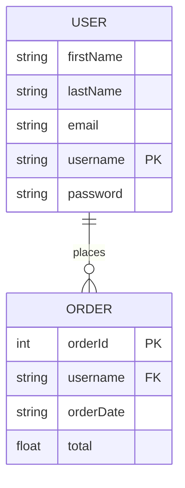
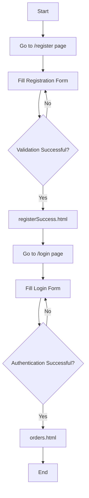

# CST-339 Project Design Report – Milestone 2

| Project Design | 9/14/2025 |
|----------------|-----------|
| 2 – Login & Registration Implementation | 9/14/2025 | 1.0 |

### Team
- Individual Project – Bruce Brown

---

### Weekly Status Summary
| User Story | Team Member | Hours Worked | Hours Remaining | Git URL | 
|------------|------------|--------------|----------------|---------|
| Milestone 2: Login & Registration Pages | Bruce Brown | 10 | N/A | https://github.com/BizzyProgramming/cst339.git |

---

### Planning & Implementation
- Updated project domain to **Pokémon Card Collection Garage**  
- Implemented **Spring MVC features**:
  - Login page with validation  
  - Registration page with validation  
  - Success page after registration
- Set up **Thymeleaf layouts**:
  - `defaultTemplate.html` for consistent header/footer
- Integrated **Bootstrap CSS** for responsive design  
- Tested pages locally using `mvn spring-boot:run`  

---

### Technical Approach
- **Backend:** Spring Boot with MVC architecture
  - `Controller Layer` → Handles `/login` and `/register` requests  
  - `Model Layer` → `LoginModel`, `RegisterModel`, `OrderModel`  
- **Frontend:** Thymeleaf templates
  - `login.html`, `register.html`, `registerSuccess.html`, `orders.html`  
  - Layout fragments for `header` and `footer`  
- **Validation:** Jakarta Bean Validation (`@Valid`) for form inputs  
- **Persistence:** No database yet (Milestone 2 requirement) — form submissions print to console  

---

### Key Technical Decisions
| Technology/Framework | Purpose | Reason for Choice |
|--------------------|---------|----------------|
| Spring Boot | Application framework | Simplifies MVC setup, integrates easily with Thymeleaf |
| Thymeleaf | Template engine | Server-side rendering for forms & layouts |
| Bootstrap | Responsive design | Quickly style forms & layout |
| Maven | Build and dependency management | Standard Java project management |
| Jakarta Validation | Form input validation | Ensures user inputs are correct before processing |

---

### Known Issues
- Local-only testing; app is not deployed externally  
- No database persistence yet (form data only prints to console)  
- Some warnings in Thymeleaf fragment syntax; works for now  

---

### Risks
- **Technical:** Thymeleaf template resolution errors (`register-success.html`)  
- **Functional:** User cannot yet login with stored database credentials  
- **Design:** Need to maintain consistent layout as more pages are added  

---

### Install Instructions
1. Clone project from GitHub: `https://github.com/BizzyProgramming/cst339/tree/main/milestones/milestone2`  
2. Ensure **Java 17** is installed  
3. Run the application: mvn spring-boot:run

### ER Diagram - Milesone 2: User & Orders

### Flowchart – Milestone 2: Login & Registration

