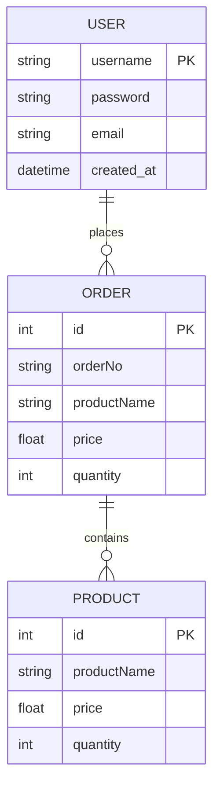
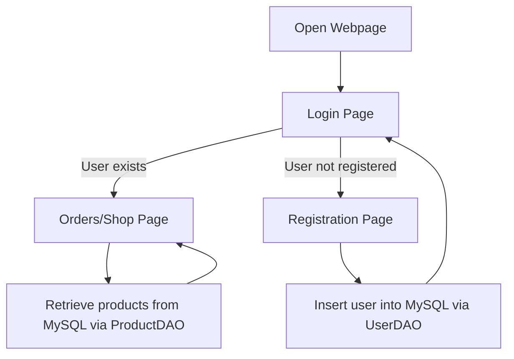

# CST-339 Project Design Report – Milestone 4

| Project Design | 9/28/2025 |
|----------------|-----------|
| 4 – JDBC Refactoring & Database Integration | 9/29/2025 | 4.0 |

### Team
- Individual Project – Bruce Brown

---

### Weekly Status Summary
| User Story | Team Member | Hours Worked | Hours Remaining | Git URL | 
|------------|------------|--------------|----------------|---------|
| Milestone 4: Refactor Login, Registration, and Product Creation modules to use Spring JDBC / DAO with persistence | Bruce Brown | 12 | N/A | https://github.com/BizzyProgramming/cst339.git |

---

### Planning & Implementation
- Refactored **Login Module** to authenticate users against **MySQL database**.  
- Refactored **Registration Module** to insert new users into the users table (username, password, email, created_at).  
- Refactored **Product/Shop Module** to pull products from the products table via **DAO pattern**.  
- Implemented **DAO classes** using JdbcTemplate (UserDAO, ProductDAO).  
- Added **Order Numbers** to the Orders page.  
- Packaged application with **Maven JAR** and successfully ran outside IDE using:
- bash
- mvn clean package
- java -jar target/topic3-2-0.0.1-SNAPSHOT.jar
- Updated Thymeleaf layouts for consistent theme and styles across login, registration, and shop

---

### Technical Approach
**Backend:** Spring Boot MVC with Spring JDBC & DAO  
- **Controllers:** LoginController, RegistrationController, OrdersController 
- **DAOs:** UserDAOImpl, ProductDAOImpl  

**Frontend:** Thymeleaf templates with common layout (defaultTemplate.html)  
- login.html, registration.html, orders.html  

**Validation:** Jakarta Bean Validation for form inputs  

**Persistence:** MySQL database with Spring JDBC  
- users table for accounts  
- products table for shop items  
- orders table mapped to products/users  

**Build & Deploy:** Maven build → packaged JAR → run from terminal 

---

### Key Technical Decisions
| Technology/Framework | Purpose | Reason for Choice |
|----------------------|---------|-----------------|
| Spring Boot | MVC framework | Simplifies web app setup and integration |
| Spring JDBC + DAO | Database access | Lightweight, clean persistence layer with JdbcTemplate |
| Thymeleaf | Templates | Dynamic rendering with layouts and fragments |
| Bootstrap | Styling | Responsive and professional UI |
| MySQL | Database | Standard relational DB for persistence |
| Maven | Build tool | Dependency management & JAR packaging |

---

### Known Issues
- No shopping cart feature yet (only product listing with order numbers).  
- No role-based access control (all users see shop).  
- Basic error handling; needs improvement for invalid login/registration.  
- Login currently redirects straight to the shop page; ideally, users should go to a landing/dashboard page first.

---

### Risks
- **Technical:** Database connection issues if MySQL not configured properly.  
- **Security:** Passwords currently lack strength requirements (min length, uppercase, special chars); passwords are stored in plaintext rather than hashed.  
- **Functional:** No admin panel for adding/removing products (must insert directly into DB).  
- **Design:** Shop page currently only lists items; future milestones may need cart or checkout system.  
- **User Flow:** Logging in redirects straight to shop page; should implement a dashboard/landing page for better UX and access control.

 ---

 ### Screenshots
 #### Login Page
 
Description:
Login page authenticates users against the users table in MySQL using Spring JDBC (UserDAOImpl). Form input is validated with Jakarta Bean Validation (@Valid).

 #### Registration Page/ Create account
 
Description: 
Registration module inserts new users into the MySQL users table. The module is refactored to use Spring JDBC with DAO pattern, and input validation ensures proper data entry.

#### Once you register using account and password, back to login page and then can login to shop page

Description: 
Product/Shop module retrieves product data from the products table via ProductDAOImpl. Each product displays its order number, name, price, and quantity, demonstrating database-driven content.

### MySQL Database - Users Table

Description:
Confirms that new users are persisted in the users table. Demonstrates that the registration module correctly inserts data via Spring JDBC.

---

#### Preview/Screen cast of my Spring Boot web application
https://www.loom.com/share/741fc4e78c2c4ec68f15818335351d2c

---

- ### ER Diagram

### Flow Chart

