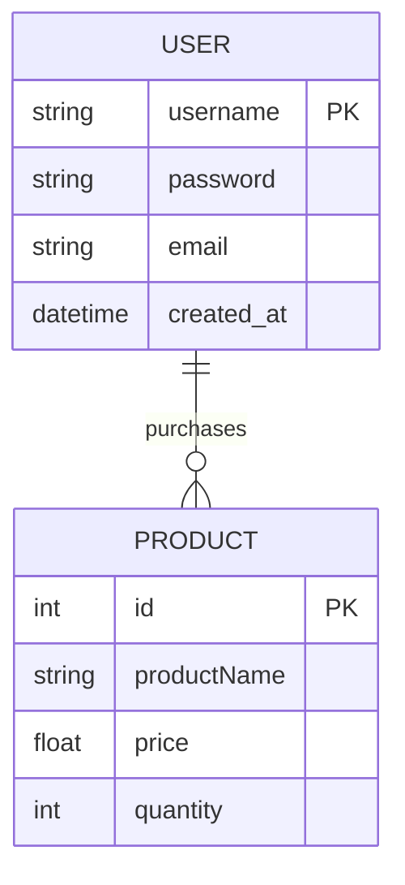
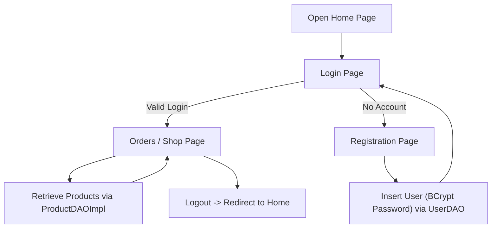

# CST-339 Project Design Report – Milestone 6

| Project Design | 10/13/2025 |
|----------------|------------|
| 6 – Spring Security Integration & Final MVC Refactor | 10/13/2025 | 4.0 |

### Team
- Individual Project – Bruce Brown

---

### Weekly Status Summary
| User Story | Team Member | Hours Worked | Hours Remaining | Git URL | 
|-------------|--------------|---------------|----------------|---------|
| Milestone 6: Integrate Spring Security for authentication and authorization; add password encryption and protected routes | Bruce Brown | 15 | N/A | https://github.com/BizzyProgramming/cst339.git |

---

### Planning & Implementation
- Integrated **Spring Security** to manage authentication and access control.  
- Created a **custom `UserDetailsService`** (`SecurityBusinessService`) to load users from MySQL.  
- Implemented **BCrypt password hashing** for secure credential storage.  
- Built a **custom login page** and **registration flow** using Thymeleaf templates.  
- Restricted `/orders` route so only authenticated users can view the shop page.  
- Added **logout functionality** that returns users to the home page.  
- Refactored project architecture into clear MVC layers (controller, business, dao, model).  
- Enhanced **UI consistency** with layout fragments (`defaultTemplate.html`) and Bootstrap.  
- Tested the full registration → login → shop → logout cycle with session management.  

---

### Technical Approach
**Backend:** Spring Boot MVC with Spring Security + JDBC/DAO  
- **Controllers:** LoginPageController, RegistrationController, OrdersController  
- **Business:** SecurityBusinessService, OrdersBusinessService  
- **DAO:** UserDAOImpl, ProductDAOImpl  
- **Configuration:** WebSecurityConfig (defines authentication providers, filter chain, and password encoder)  

**Frontend:** Thymeleaf templates with layout fragments and Bootstrap styling  
- login.html, registration.html, orders.html, layouts/defaultTemplate.html  

**Validation:** Jakarta Bean Validation annotations (@NotNull, @Size)  

**Persistence:** MySQL database with Spring JDBC  
- users table for credentials (username, password, email, created_at)  
- products table for shop inventory  

**Security Flow:**  
- Registration encrypts password with BCrypt before storing in MySQL.  
- Spring Security authenticates via `AuthenticationManager` using the stored hash.  
- Successful login redirects to `/orders`; unauthenticated users redirected to `/login`.  

**Build & Deploy:** Maven build → packaged JAR → run from terminal  

---

### Key Technical Decisions
| Technology/Framework | Purpose | Reason for Choice |
|----------------------|----------|------------------|
| Spring Security | Authentication & Authorization | Provides secure login and access control |
| BCryptPasswordEncoder | Password encryption | Industry-standard password hashing |
| Spring Boot MVC | Application Framework | Simplifies web development with dependency injection |
| JdbcTemplate + DAO Pattern | Data Access | Clean, modular database operations |
| Thymeleaf + Bootstrap | UI Templates | Dynamic, responsive front-end |
| MySQL | Database | Relational data persistence |
| Maven | Build Tool | Dependency management and packaging |

---

### Known Issues
- No role-based user access (e.g., Admin vs User).  
- No password strength policy validation.  
- Basic login/registration error messages; future improvement needed.  
- Admin interface for managing products not yet implemented.  
- Limited unit tests for security and DAO components.  

---

### Risks
- **Database:** Failure if MySQL service unavailable or credentials incorrect.  
- **Security:** No brute-force protection or password complexity checks yet.  
- **Design:** Future role management will require additional config updates.  
- **UX:** Login redirects directly to shop; dashboard could improve navigation.  

---

### Screenshots

#### Home Page

Description: 
The new **Home Page** serves as the application’s landing screen.  
It provides navigation links to **Login**, **Create Account**, and **Shop (Orders)**.  
Unauthenticated users are redirected here after logout, and the layout maintains a consistent Bootstrap theme with navigation bar and hero section.

#### News & Events Page

Description:
The new **News & Events Page** showcases announcements, upcoming updates, or promotions.  
It uses the same Thymeleaf layout for consistent navigation and appearance.  
This page is **publicly accessible** and helps make the application feel more dynamic and realistic.

#### Login Page
  
Description:  
Custom login form integrated with Spring Security. Valid credentials route users to `/orders`, invalid ones show an error.

#### Registration Page
  
Description:
Creates new users and stores their credentials in MySQL using BCrypt encryption.

#### Orders / Shop Page
  
Description:  
Displays shop products from the `products` table. Only visible to logged-in users.

#### MySQL Users Table

**Description:**  
Shows stored BCrypt password hashes, proving encryption works correctly.

---

#### Preview/Screen cast of my Spring Boot web application
https://www.loom.com/share/dd00d50b4eff40fb8f0a355ea608392b

---

- ### ER Diagram

### Flow Chart

