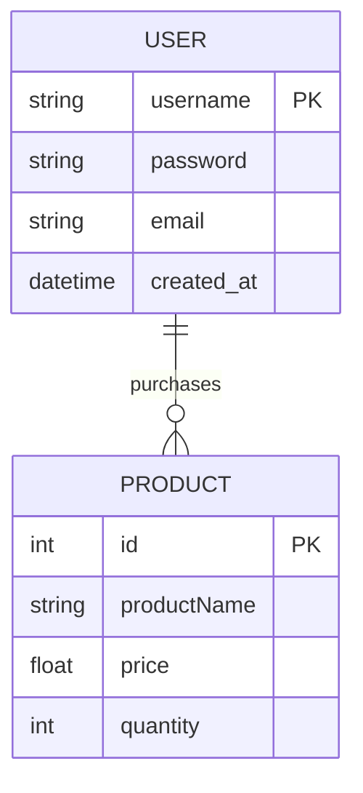
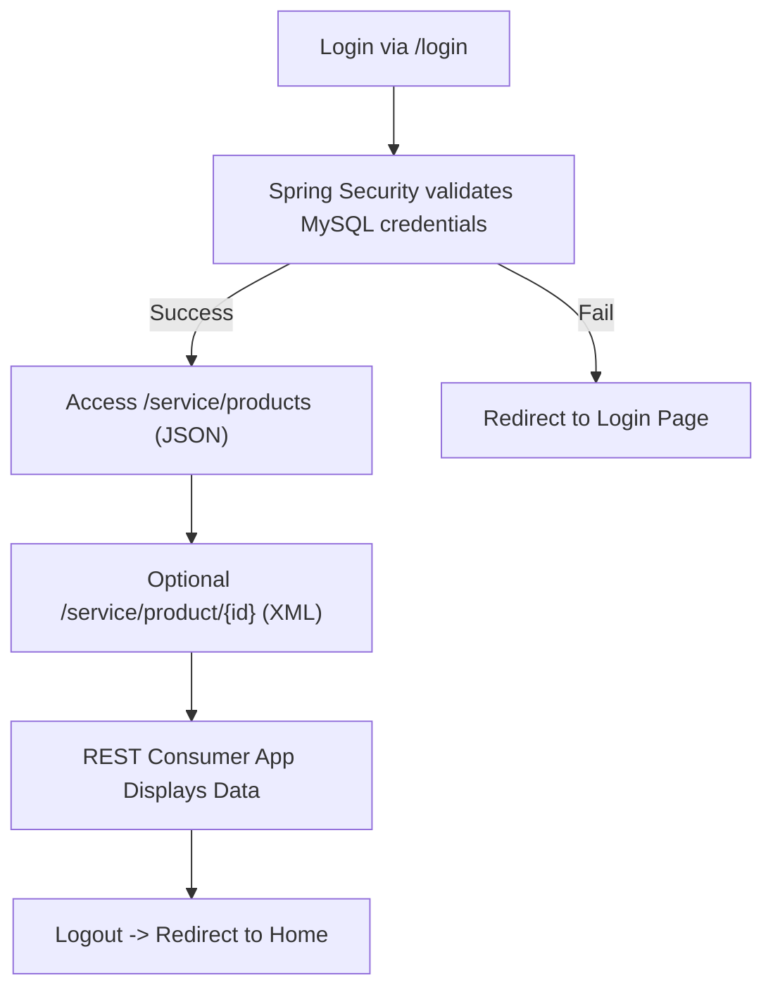

# CST-339 Project Design Report – Milestone 7

| Project Design | 10/19/2025 |
|----------------|------------|
| 7 – Microservices and REST API Implementation | 10/19/2025 | 4.0 |

### Team
- Individual Project – Bruce Brown

---

### Weekly Status Summary
| User Story | Team Member | Hours Worked | Hours Remaining | Git URL | 
|-------------|--------------|---------------|----------------|---------|
| Milestone 7: Build and secure REST APIs using microservices architecture; add JSON and XML endpoints for products | Bruce Brown | 15 | N/A | https://github.com/BizzyProgramming/cst339.git |

---

### Planning & Implementation
- Developed two **REST APIs**:  
  - `/service/products` → Returns all products.  
  - `/service/product/{id}` → Returns a single product by ID.  
- Implemented **microservice structure** separating API endpoints from the consumer web UI.  
- Integrated **Spring Security Basic HTTP Authentication** to secure API endpoints using credentials from MySQL.  
- Used **BCrypt hashing** for all stored passwords in the database.  
- Updated `OrdersRestService` to return **JSON** and **XML** formatted data.  
- Verified functionality in both **browser** and **Postman**.  
- Refactored the application to meet **RESTful standards**, using `@RestController` and `@GetMapping`.  
- Enhanced database connection for `ProductDAO` and refactored queries to map product attributes properly.  
- Ensured all services (Consumer App, Product Service, and Security) run independently.  

---

### Technical Approach
**Backend:** Spring Boot MVC with RESTful microservices, Spring Security + JDBC/DAO  
- **Controllers:** HomeController, LoginPageController, RegistrationController, OrdersController  
- **Business:** ProductBusinessService, SecurityBusinessService, OrdersRestService  
- **DAO:** ProductDAOImpl, UserDAOImpl  
- **Configuration:** WebSecurityConfig (defines authentication providers, Basic HTTP Auth, and filter chain)  

**Frontend:** Thymeleaf templates integrated with Bootstrap and reusable layouts (defaultTemplate.html, common.html).  

**Persistence:** MySQL database accessed through Spring JDBC with JdbcTemplate.  
- **Tables:**  
  - users → For authentication (username, password, email, created_at).  
  - products → For REST API display (id, productName, price, quantity).  

**Testing & Verification:**  
- Tested JSON and XML output for /service/products and /service/product/1.  
- Verified HTTP Basic Authentication with valid and invalid credentials.  
- Confirmed consumer UI displays product data retrieved via REST APIs.

---

### Key Technical Decisions
| Technology/Framework | Purpose | Reason for Choice |
|----------------------|----------|------------------|
| Spring Boot | Backend Framework | Simplifies dependency management and configuration |
| Spring Security | Authentication & Authorization | Enforces API protection and secure login |
| BCryptPasswordEncoder | Password encryption | Industry-standard password hashing |
| REST API / JSON / XML | Data communication format | Enables interoperable, flexible service communication |
| MySQL | Database | Reliable, structured data persistence |
| Maven | Build Tool | Handles dependencies and project packaging |

---

### Known Issues
- Role-based security (Admin vs User) not yet implemented.  
- No global exception handler for REST API error responses.  
- Microservices run locally, not yet containerized via Docker.  
- Unit tests for REST endpoints pending for future milestone.  

---

### Risks
- **Database Connection:** Failure if MySQL credentials or port changes.  
- **Security:** APIs rely on HTTP Basic Auth; OAuth2 could improve scalability.  
- **Service Dependencies:** Consumer app depends on the API service availability.  
- **Deployment:** Future integration with Eureka or Kubernetes could add complexity.  

---

### Screenshots

#### 1. Product REST API – All Products (JSON Output)

 **Description:** Displays all product records returned by the `/service/products` endpoint in JSON format. Tested successfully using Postman after authentication, confirming that the REST API correctly retrieves all products from the MySQL database.

#### 2. Product REST API – Single Product by ID

**Description:** Retrieves a single product record by ID using the `/service/product/1` endpoint. This demonstrates dynamic route parameter handling and proves the REST controller correctly interacts with the business and DAO layers.

#### 3. Product REST API – All Products (Browser Output)

**Description:** Displays all product records directly in the **browser** by visiting `/service/products`. This confirms that the endpoint returns valid JSON output when authenticated, demonstrating the REST API functions independently from the front-end consumer.

#### 4. Consumer Web Application Integration (Home, Orders, and Users Pages)

**Description:** These web pages use `RestTemplate` calls to consume the `/service/products` and `/service/product/{id}` endpoints, integrating the REST microservices into the MVC application. This demonstrates **multi-layered architecture** where services operate independently yet communicate seamlessly.

#### 5. Testing JSON before logging in

---

### Research Questions

#### 1. Describe what microservices are. How does this architecture style differ from traditional monolithic architectures?
Microservices are an architectural style that breaks a large application into smaller, independent services, each responsible for a specific task (e.g., authentication, billing, or content delivery).  
Each service runs in its own process, has its own database, and communicates via REST APIs.  
This design allows developers to deploy, maintain, and scale each service independently.  
In contrast, monolithic architectures combine all components—UI, logic, and database—into a single unit, making updates slower and scaling less flexible.  

**References:**  
- GeeksForGeeks. (2025). [What are Microservices?](https://www.geeksforgeeks.org/system-design/microservices/)  
- Netflix Tech Blog. (2024). [Rebuilding Netflix Video Processing Pipeline with Microservices.](https://netflixtechblog.com/rebuilding-netflix-video-processing-pipeline-with-microservices-4e5e6310e359)

---

#### 2. What are 5 challenges you might encounter when modifying a monolithic architecture to a microservice architecture style?
1. **Service Communication:** Managing API calls and ensuring reliability between independent services.  
2. **Data Management:** Maintaining data consistency across multiple service databases.  
3. **Deployment Complexity:** Coordinating the deployment and scaling of multiple microservices.  
4. **Security:** Managing authentication and authorization across services.  
5. **Increased Infrastructure Complexity:** Requires service discovery, orchestration, and monitoring tools.  

**Reference:**  
- AWS. (2025). [Building Microservices on AWS.](https://aws.amazon.com/microservices/)  

---

### Conclusion
This milestone demonstrated how to design and secure REST APIs within a microservice architecture using Spring Boot.  
By separating services (User, Orders, and Product), I achieved improved modularity, scalability, and maintainability.  
Securing endpoints with Basic HTTP Authentication strengthened the application’s reliability, and testing JSON/XML outputs showcased interoperability across systems.  
Milestone 7 provided valuable insight into the foundation of distributed systems and modern enterprise-class applications.

---

### ER Diagram

### Flow Chart

