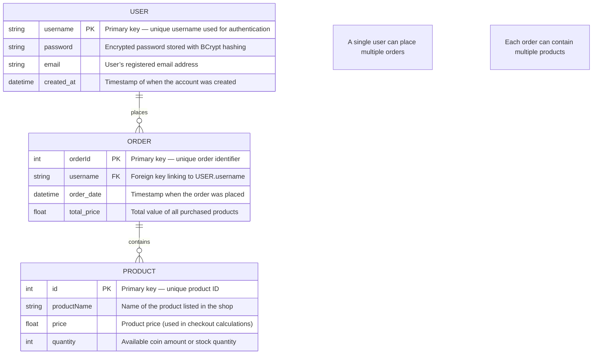
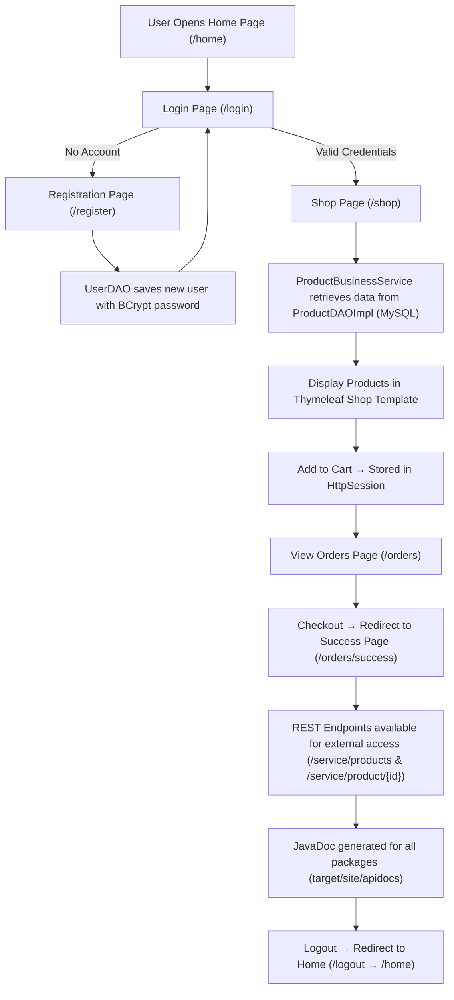

# CST-339 Project Design Report – Milestone 8

| Project Design | 10/26/2025 |
|----------------|------------|
| 8 – RESTful Services, JavaDoc Generation, and Final System Update | 10/26/2025 | 4.0 |

### Team
- Individual Project – Bruce Brown

---

### Weekly Status Summary
| User Story | Team Member | Hours Worked | Hours Remaining | Git URL | 
|-------------|--------------|---------------|----------------|---------|
| Milestone 8: Add RESTful web services, generate JavaDoc, and finalize application for submission | Bruce Brown | 15 | N/A | https://github.com/BizzyProgramming/cst339.git |

---

### Planning & Implementation
- Added **RESTful endpoints** for external data access under `/service`.  
- Implemented **ProductRestService** and **OrdersRestService** classes returning JSON and XML.  
- Refined **ProductBusinessService** to support REST controllers through the business interface.  
- Generated full **JavaDoc documentation** using the Maven `javadoc:javadoc` plugin.  
- Added missing **Javadoc comments** across all business, DAO, and model classes.  
- Fixed compilation issues caused by malformed JavaDoc syntax.  
- Verified documentation output in `/target/site/apidocs/index.html`.  
- Cleaned up **Spring Security config** (`WebSecurityConfig`) for secure endpoints (`/shop`, `/orders`, `/service/**`).  
- Updated and organized **Thymeleaf templates** for all pages: login, register, shop, orders, and success.  
- Finalized folder structure and ensured proper MVC separation.  

---

### Technical Approach
**Backend:** Spring Boot MVC + Spring Security + REST Services  
- **Controllers:** `ProductRestService`, `OrdersRestService`, `ShopController`, `HomeController`, `LoginPageController`, `RegistrationController`, `OrdersController`  
- **Business:** `ProductBusinessService`, `SecurityBusinessService`  
- **DAO:** `ProductDAOImpl`, `UserDAOImpl`  
- **Models:** `OrderModel`, `CartItem`, `LoginModel`, `RegistrationModel`, `OrdersList`  
- **Configuration:** `WebSecurityConfig` for protected routes and password encryption  

**Frontend:** Thymeleaf templates styled with Bootstrap  
- Templates: `home.html`, `login.html`, `registration.html`, `shop.html`, `orders.html`, `success.html`, `news.html`, `layouts/defaultTemplate.html`  

**Validation:** Jakarta Bean Validation (`@NotNull`, `@Size`)  

**Persistence:** MySQL database accessed through Spring JDBC (`JdbcTemplate`)  
- `users` table stores encrypted credentials  
- `products` table supplies inventory for the shop and REST APIs  

**Documentation:**  
- Generated project API documentation with:
  ```bash
  mvn javadoc:javadoc

**Security Flow:**  
- All passwords are encrypted using **BCrypt** before being stored in MySQL.  
- **Spring Security** validates user credentials against the encrypted hash on login.  
- Protected routes (`/shop`, `/orders`, `/service/**`) can only be accessed by authenticated users.  
- Unauthenticated users are automatically redirected to `/login`.  
- **Logout** functionality clears the session and redirects users to the home page.  

**Build & Deploy:**  
- Project is built and packaged using **Maven**.  
- JavaDoc generated with:
  ```bash
  mvn javadoc:javadoc

---

### Key Technical Decisions
| Technology/Framework | Purpose | Reason for Choice |
|----------------------|----------|------------------|
| REST Controllers | Provide external API endpoints | Added to expose product and order data in JSON/XML formats under `/service` |
| Maven Javadoc Plugin | Documentation generation | Implemented to automatically create full HTML JavaDoc for all project classes |
| Spring Security (Updated) | Secure REST and MVC endpoints | Refined configuration to protect `/shop`, `/orders`, and `/service/**` routes |
| Thymeleaf Templates (Revised) | Front-end rendering | Updated and organized UI templates for consistency across pages |
| MVC Folder Structure | Code organization | Finalized layout separation between controller, business, dao, and model layers |
| Maven Build Lifecycle | Packaging and deployment | Used to build, generate JavaDoc, and run the final application from terminal |

---

### Known Issues
- REST endpoints currently do not include authentication or access restriction.  
- JavaDoc generation requires all methods to have comments or it fails the build.  
- Limited exception handling for REST API requests (e.g., invalid product IDs).  
- No pagination or filtering for REST responses — all products return at once.  
- Minor UI alignment issues across updated Thymeleaf templates.  
- Unit tests for new REST services and DAO logic not yet implemented.   

---

### Risks
- **API Stability:** REST endpoints may expose data if not secured or rate-limited properly.  
- **Documentation:** JavaDoc build can fail if any public methods lack comments, delaying deployment.  
- **Database:** Service endpoints depend on live MySQL connections; downtime affects API responses.  
- **Security:** REST services are public and could be accessed without authentication if misconfigured.  
- **Testing:** Limited automated testing increases risk of unnoticed issues in REST and DAO layers.  
- **Deployment:** Maven build errors (especially in Javadoc) can block release if not resolved before submission.  

---

### Screenshots

#### RESTful Service – All Products (JSON Output)

**Description:**  
Displays JSON data returned from the `/service/products` endpoint.  
Confirms the new RESTful service layer (`ProductRestService`) works correctly and returns product data through the business interface.

---

#### RESTful Service – Single Product (JSON Output)

**Description:**  
Shows the `/service/product/{id}` endpoint successfully returning a single product object in JSON format.

---

#### JavaDoc Overview Page

**Description:**  
Generated using Maven’s `javadoc:javadoc` goal.  
Displays the API documentation site (`target/site/apidocs/index.html`) showing all project packages and class documentation.

---

#### Maven Build Success

**Description:**  
Shows successful Maven build output including JavaDoc generation with `[INFO] BUILD SUCCESS`.  
Confirms that all methods are documented and the project compiles cleanly.

---

#### Final Project Structure


**Description:**  
Displays the finalized MVC project organization with clearly separated `controller`, `business`, `dao`, `model`, and `templates` packages.  
Ensures best practices for Spring Boot architecture.

---

#### Preview/Screen cast of my Spring Boot web application
https://www.loom.com/share/dd00d50b4eff40fb8f0a355ea608392b

---

- ### ER Diagram



### Flow Chart


